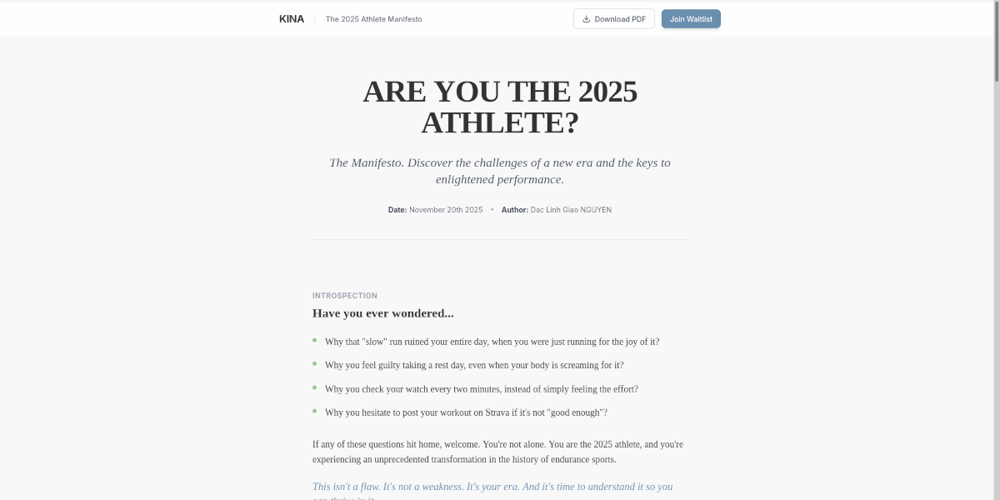

# KINA - The 2025 Athlete Manifesto Reader



An interactive, editorial-style web application designed to present the **"Are You the 2025 Athlete?"** manifesto.

This project transforms the static manifesto content into an engaging digital experience, bridging the gap between a
traditional landing page and a downloadable resource.


## 🏃‍♂️ About The Project

KINA is an AI Running Companion project. This repository hosts the interactive reader for its founding manifesto.

**Key Goals:**

1. **Readability:** Provide a distraction-free, magazine-quality reading experience on mobile and desktop.
2. **Conversion:** Integrate "Join Waitlist" calls-to-action seamlessly.
3. **Distribution:** Allow users to generate a perfectly formatted A4 PDF directly from the browser using the native
   print engine.

## ✨ Features

* **⚡ Modern Tech Stack:** Built with React 18, TypeScript, and Vite for blazing fast performance.
* **🎨 Custom Design System:**
    * Strict adherence to the KINA palette (`#6A8EAE`, `#99C794`).
    * Editorial typography pairing: *Merriweather* (Serif) for body text and *Inter* (Sans) for UI elements.
* **print-to-PDF Engine:** Custom CSS `@media print` rules ensure the web page converts to a paginated, clean A4
  document without UI clutter (buttons, navbars).
* **📊 Reading Progress:** A sticky reading progress bar at the top of the viewport.
* **📱 Fully Responsive:** Optimized for all screen sizes.

## 🛠️ Getting Started

### Prerequisites

* Node.js (v18+ recommended)
* npm

### Installation

1. **Clone the repository:**
   ```bash
   git clone https://github.com/kmmania/kina-manifesto.git
   cd kina-manifesto
   ```

2. **Install dependencies:**
   ```bash
   npm install
   ```
   *Note: This project uses Tailwind CSS v3.4.*

3. **Run locally:**
   ```bash
   npm run dev
   ```
   Open `http://localhost:5173` in your browser.

### Building for Production

To create a production-ready build:

```bash
npm run build
```

## 🎨 Design System

The application uses a specific color palette defined in `src/types.ts` and applied via Tailwind:

| Color         | Hex       | Usage                           |
|---------------|-----------|---------------------------------|
| **Blue**      | `#6A8EAE` | Primary actions, highlights     |
| **Green**     | `#99C794` | Secondary accents, progress bar |
| **Dark Grey** | `#333333` | Primary text                    |
| **Off White** | `#F8F8F8` | Page background                 |

## 📂 Project Structure

```
src/
├── components/       # Reusable UI components
│   ├── Header.tsx    # Sticky header with progress bar
│   ├── ManifestoContent.tsx  # The core text content
│   └── ...
├── types.ts          # TypeScript definitions & Constants
├── App.tsx           # Main layout
└── index.css         # Tailwind directives & Print styles
```

## 📄 License & Copyright

**Content:** © 2025 - Dac Linh Giao NGUYEN / KM Mania Research.  
*The text content is protected by copyright but authorized for distribution in its entirety.*

**Code:** This repository is the technical implementation of the KINA Manifesto Reader.
